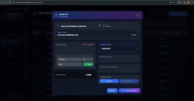
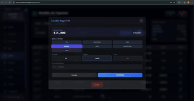
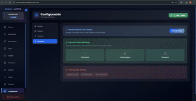

<p align="center">
  <a href="https://github.com/marioaug/mipos-bester-showcase">
    
  </a>
</p>

<h1 align="center">miPOS Bester</h1>

<p align="center">
  <strong>Sistema Integral de Punto de Venta y Gestión de Servicio Técnico</strong>
</p>

<p align="center">
  
  
  
</p>

---

## 📖 Descripción

**miPOS Bester** es una solución profesional diseñada para optimizar negocios de tecnología. Permite un control exhaustivo de stock, seguimiento de reparaciones y balances de caja en tiempo real, todo bajo una infraestructura escalable en la nube.

El sistema transforma la gestión manual en un flujo digital seguro, eliminando errores humanos en la facturación y el servicio técnico.

## 🚀 Características Principales

* **💳 Punto de Venta (POS):** Facturación ágil con soporte para Efectivo, Tarjeta y QR integrado.
* **🔧 Servicio Técnico:** Gestión completa de reparaciones con estados (Pendiente, Diagnóstico, En Proceso, Entregado). **Bloqueo de entrega por deuda.**
* **📦 Inventario Inteligente:** Alertas de stock bajo, organización por categorías y validación de precios.
* **💰 Control de Caja:** Registro detallado de ingresos, egresos, caja chica y conciliación de tarjetas.
* **🔐 Seguridad:** Autenticación robusta, roles de usuario (Admin/Vendedor) y validación de datos estricta (Zod).

## 🛠️ Stack Tecnológico

El proyecto utiliza una arquitectura moderna y escalable:

<div align="center">
  <a href="https://skillicons.dev">
    
  </a>
  <br>
  <p align="center">
    <i>(React, Tailwind, Node.js, Express, PostgreSQL, Prisma, Nginx, DigitalOcean + PM2)</i>
  </p>
</div>

<br>

<h2 align="center">📸 Vistazo al Sistema</h2>

<div align="center">
  <table border="0" style="display: table !important; width: auto !important; margin-left: auto !important; margin-right: auto !important; border: none; border-collapse: collapse;">
    <tr>
      <td align="center" valign="top" style="padding: 15px; border: none;">
        <p align="center"><b>💳 Punto de Venta Ágil</b></p>
        
      </td>
      <td align="center" valign="top" style="padding: 15px; border: none;">
        <p align="center"><b>🔧 Gestión de Taller</b></p>
        
      </td>
    </tr>
    <tr>
      <td align="center" valign="top" style="padding: 15px; border: none;">
        <p align="center"><b>🃏 Conciliación de Tarjetas</b></p>
        
      </td>
      <td align="center" valign="top" style="padding: 15px; border: none;">
        <p align="center"><b>⚙️ Configuración Admin</b></p>
        
      </td>
    </tr>
  </table>
</div>

<br>

## 📈 Próximos Pasos (Roadmap)

- [ ] **Reportes Avanzados:** Gráficos de rentabilidad mensual exportables a Power BI.
- [ ] **Facturación Electrónica:**  Conexión y configuración de certificados de ARCA para emisión de tks electrónicos.

## ⚙️ Instalación (Dev Mode)

Requisitos: Node.js v18+ y PostgreSQL.

1.  **Clonar el repositorio:**
    ```bash
    git clone [https://github.com/tu-usuario/mipos-bester.git](https://github.com/tu-usuario/mipos-bester.git)
    ```

2.  **Instalar dependencias:**
    ```bash
    cd backend && npm install
    cd ../frontend && npm install
    ```

3.  **Configurar Variables de Entorno (.env):**
    Configurar `DATABASE_URL`, `JWT_SECRET` y puertos.

4.  **Iniciar Servidor:**
    ```bash
    # Backend
    npx prisma generate
    npm run dev

    # Frontend
    npm run dev
    ```

---

## 📬 Contacto / Licencia

Este proyecto es un **software comercial propietario** desarrollado por **Mario Ballester**.
El código fuente aquí expuesto es solo con fines demostrativos (Showcase).

Si te interesa adquirir una licencia de uso para tu negocio o solicitar una demo en vivo:

* 📩 **Email:** [mario_ballester@hotmail.com](mailto:mario_ballester@hotmail.com)
* 💼 **LinkedIn:** [Ver Perfil de LinkedIn](https://www.linkedin.com/in/marioballester10/)

&copy; 2026 Bester POS. Todos los derechos reservados.

<br>

<p align="center">Desarrollado con ❤️ para la optimización de negocios tecnológicos.</p>

<p align="center"><b>Bester Servicio Técnico y Soluciones Digitales a medida</b> - Corrientes, Argentina 2025</p>


